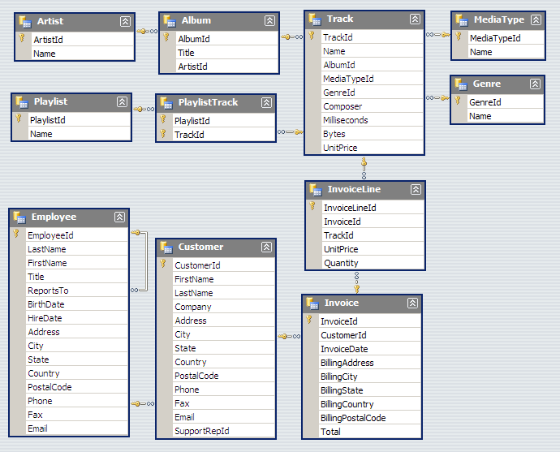

# SQL Project - Chinook Music Store Database

## Introduction
Welcome to my SQL project on the Chinook Music Store Database. This project leverages structured SQL queries and a detailed relational database schema to provide a deep dive into the sales and operations of a typical music retail business. Covering key entities like `Artist`, `Album`, `Track`, and more, this analysis reveals intricate relationships and driving factors behind music sales and trends.

## Analysis Questions
We tackle the following key business questions to uncover insights into the store's operations:
1) **Top Revenue Contributing Artists**: Identify the top 10 artists contributing the most to total revenue and their respective contributions.
2) **Most Popular Albums**: Discover which albums contain the top 10 most-sold songs.
3) **Top Genres by Sales**: Analyze the top 10 genres sold by quantity.
4) **Artists with Extensive Catalogs**: Find out which artists have the highest number of albums.
5) **Leading Artists by Genre**: Determine the top 3 selling artists within each genre.

## Database Schema

## Repository Contents
- `chinook.db` - Database file containing tables that make up the Chinook Music Store database.
- `ChinookDatabaseSchema1.1.png` - Image depicting the schema of the database.
- `chinook.sqbpro` - SQLite file containing the database and queries. This file is optimized for use with [DB Browser for SQLite](https://sqlitebrowser.org/dl/)—a tool that allows you to open, query, and manage SQLite databases easily.
- `SQL Queries.txt` - Contains all the queries made from the database.
- `Final Presentations` - This file contains the questions, inputs, outputs, visualizations, and a summary of our findings, providing a comprehensive overview of the project.

## Conclusion
This project provides valuable insights into the dynamics of a music retail operation, highlighting the potential of SQL for deep data-driven analysis. It serves as a practical example for those interested in applying SQL to real-world datasets to uncover business insights.

## Data Source
https://www.kaggle.com/datasets/nancyalaswad90/chinook-sample-database
